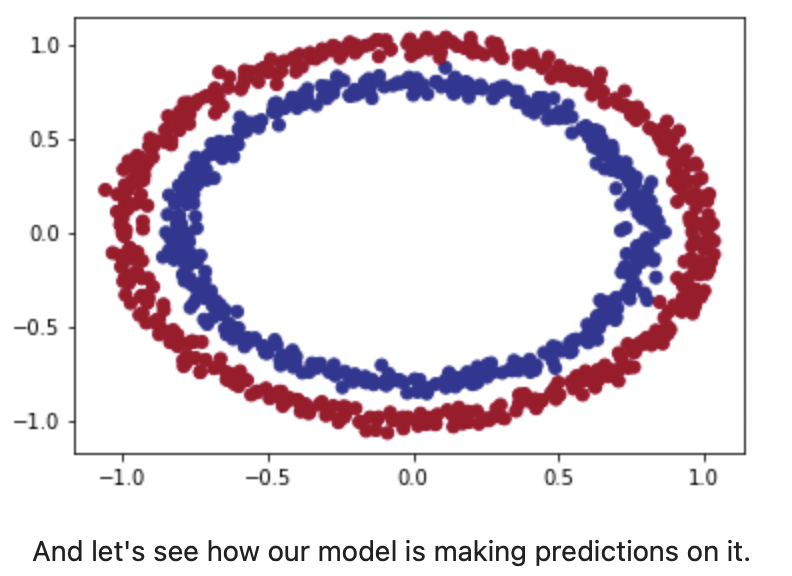
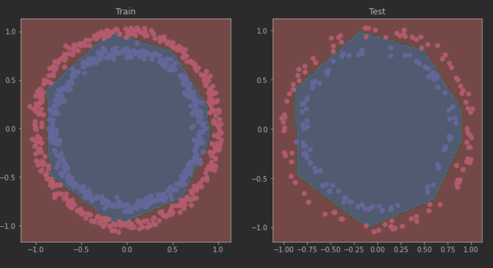

# BINARY CLASSIFICATION

Dans ce Projet, on va essayer de classifier deux sortes de boules 
de couleurs rouge et bleu. 

Ces boules forment un circle en fonction de leur couleurs.

Et donc l'objectif est de séparer les deux cercles en créant donc
un nouveau cercle entre les deux cercles.

Pour cela 

## Auteur
ABDOULAYE BALDE
