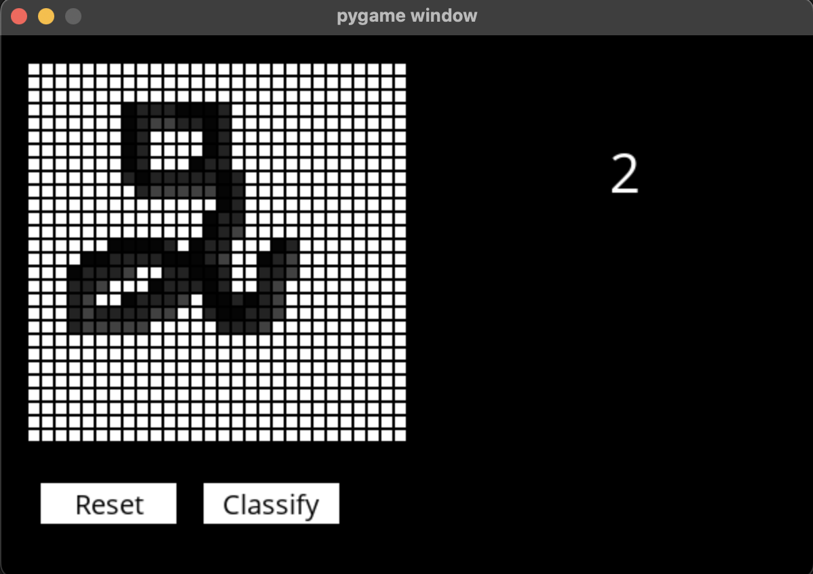

# DIGITS 

Création et implémentation d'une IA en language Python dans le jeu Morpion contre qui le joueur peut challenger.

Pour lancer le jeu, il faut d'abord installer les librairies nécessaires: 
```pip3 install -r requirements.txt```. 
Surtout il faut installer ```Tensorflow``` pour charger le modèle de l'IA.

Ensuite, Pour lancer la prediction: 
```python3 recognizer.py model.h5```



Pour comprendre le fonctionnement de cette IA, il faudrait regarder le fichier ```handwitring.py``` qui contient le traitement des données de centaines d'images de chiffres notés à la main et la création du modèle , qui est juste un ```convolutional neural network```.
Ensuite vient la prédiction du chiffre à partir de l'image que l'utilisateur vient de dessiner, ceci est fait dans le fichier ```recognizer.py```.

## Auteur
ABDOULAYE BALDE
