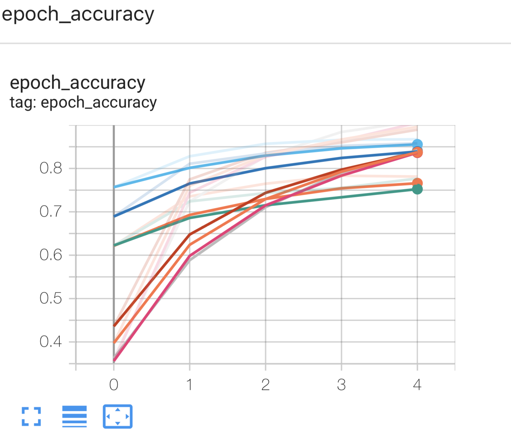

# IA, WHAT IS THE NAME OF THAT FOOD?

Ici, dans ce projet, nous allons utiliser le TRANSFER LEARNING pour
classer des images de nourriture.

Nous allons utiliser deux modèles pré-entrainés: ResNet50V2 et EfficientNetB0.

Nous allons comparer les performances de ces deux modèles, puis ensuite
faire des prédictions sur des images de nourriture.
Toute la partie recherche et choix du modèle est dans le notebook:
``food_vision_transfert_learning.ipynb``

Au vu de l'efficacité du modèle EfficientNetB0, nous avons opter ce modèle et
nous l'avons entrainé avec peu de données (250 images par classe).
Et donc les classes sont les suivantes: 'chicken_curry', 'chicken_wings', 'fried_rice', 'grilled_salmon',
'hamburger', 'ice_cream', 'pizza', 'ramen', 'steak','sushi'.
Nous avons donc conditionner le modèle pour qu'il ne prédise que ces classes.

Finalement le modèle donne une performance de 80% sur le jeu de test avec tres peu de données et 
de paramètres (4,049,564 pour EfficientNetB0 vs. 23,564,800 pour ResNet50V2).



Pour lancer la prediction sur une image, il faut lancer le script:
predict.py avec la commande suivante:

```python predict.py path/to/image```

Exemple d'utilisation:

```python predict.py steak.jpg```

## Auteur
ABDOULAYE BALDE
