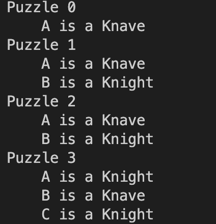

## Knights

Création et implémentation d'une IA qui résout un puzzle du jeu "Knights and Knaves" en faisant des déductions.

Dans ce jeu, on a 4 puzzle à résoudre. Mais ici l'objectif reste de laisser notre IA le faire à notre 
place. 

Dans ce jeu, on a deux types de personnages: knights et knaves. Les knights disent toujours la vérité et les knaves disent toujours des mensonges.

Voici les puzzles:
# Puzzle 0
```A says "I am both a knight and a knave."```

# Puzzle 1
``` A says "We are both knaves."```
``` B says nothing.```


# Puzzle 2
``` A says "We are the same kind."```
```B says "We are of different kinds."```

# Puzzle 3
``` A says either "I am a knight." or "I am a knave.", but you don't know which.```
``` B says "A said 'I am a knave'."```
``` B says "C is a knave."```
``` C says "A is a knight."```

L'objectif du jeu est de trouver la vérité sur les personnages A, B et C.

Pour cela on va utiliser des symboles de logique propositionnelle pour représenter les informations, par exemple: And, Or, Not, =>, <=>, etc.
Cette manière de representer la logic de chaqu'un de ces symboles mathématiques est expliquée dans le fichier ```logic.py```.
Nous ici, on s'occupera de donner des hypothèses à notre IA pour qu'elle puisse faire des déductions et trouver la solution.

Ensuite, il faut lancer le fichier puzzle.py: 
```python3 puzzle.py```




## Auteur
ABDOULAYE BALDE
