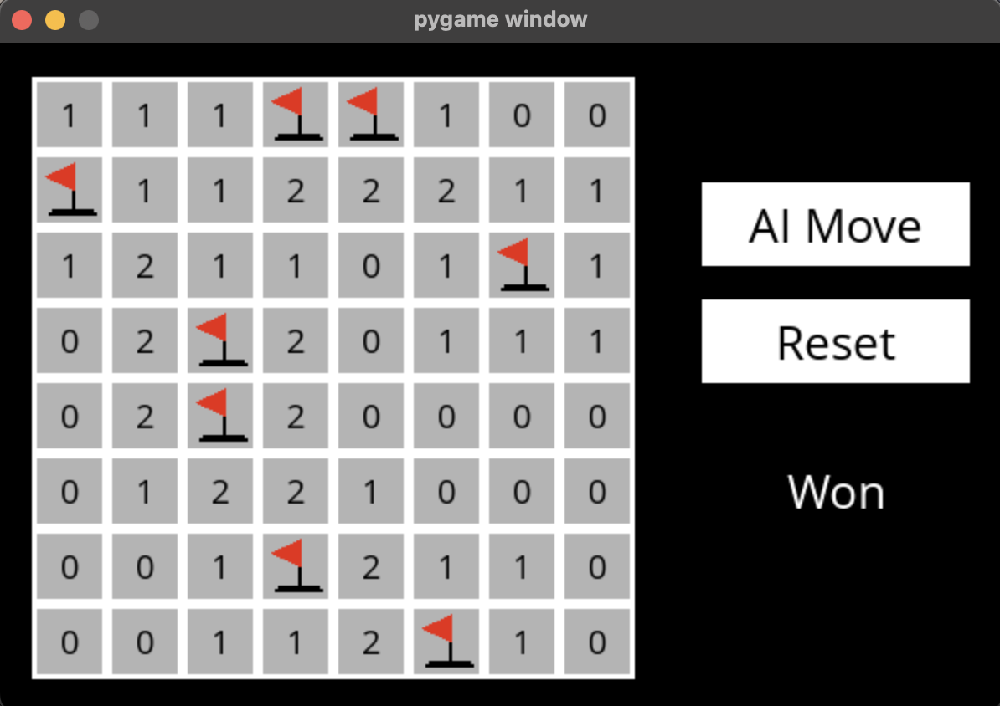

# MINESWEEPER

Création et implémentation d'une IA dans le jeu démineur capable de donner la bonne réponse (à 90%) au joueur qui n'arrive pas à trouver une solution de lui même.



Pour lancer le jeu, il faut d'abord installer les librairies nécessaires: 
```pip3 install -r requirements.txt```

Ensuite, il faut lancer le fichier runner.py: 
```python3 runner.py```

Pour comprendre le fonctionnement de l'IA, il faut regarder le fichier ```minesweeper.py```.
En effet, sachant que le jeu de démineur donne des indices sur le nombre de mines autour d'une case, 
on cherche donc ici à avoir une Knowledge Base qui contient toutes les cases qui sont sûres et toutes les cases qui sont sûres d'être des mines et en fonction de ces informations, notre IA va faire des déductions pour trouver la solution.
Le fichier ```test.py``` permet de faire des tests unitaires sur les fonctions utilisées dans la création de l'IA.

## Auteur
ABDOULAYE BALDE
