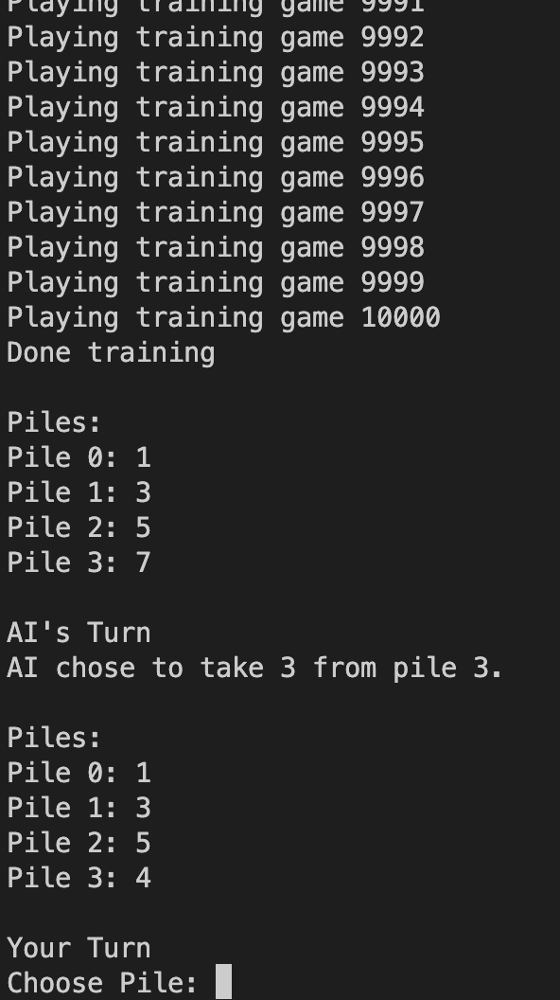
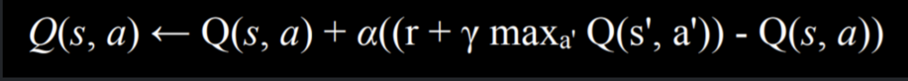

# NIM

Création et implémentation d'une IA qui apprend d’elle même à jouer le jeu NIM; de plus en plus cette IA s'entraine, elle devient forte.

Nim est un jeu de stratégie combinatoire pour deux joueurs, se jouant à tour de rôle. Il s'agit d'un jeu de prise, où les joueurs doivent retirer des objets dans des piles. Le joueur ,qui retire le dernier objet dans la dernière pile non vide, perd la partie.
Ici, on a 4 piles de 1, 3, 5 et 7 objets. Au debut du jeu, l'IA doit s'entrainer pour apprendre à jouer contre elle même. Ensuite, le joueur peut challenger l'IA.
Le nombre d'essais est paramétrable dans le fichier play.py.
Dans mon cas j'ai choisi 10000 essais pour qu'elle soit très forte. (on aime quand c'est dur 😎)

Ensuite, il faut lancer le fichier runner.py: 
```python play.py```



Pour comprendre le fonctionnement de l'IA, il faut regarder le fichier ```nim.py```.
En effet, on utilise le concept de Q-learning pour l'entrainement de l'IA avec la formule suivante:


En addition à cela on utilise Epsilon-greedy pour l'exploration de l'espace d'état car on veut que l'IA ne se contente pas de jouer toujours la même stratégie.


## Auteur
ABDOULAYE BALDE
