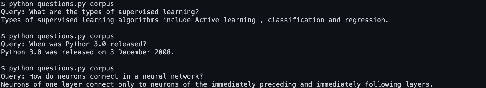

# QUESTIONS

Création et implémentation d'une IA qui réponds aux questions en faisant des phrases.



Pour lancer le jeu, il faut d'abord installer les librairies nécessaires: 
```pip3 install -r requirements.txt```

Ensuite, il faut lancer le fichier questions.py: 
```python3 questions.py```

Question Answering (QA) est un domaine de  natural language processing (NLP) qui consiste à répondre à des questions en utilisant des informations provenant de textes.

Notre système de questions-réponses effectuera deux tâches : la récupération de documents et la récupération de passages. Notre système aura accès à un corpus de documents texte. Lorsqu'une requête est présentée (une question en anglais posée par l'utilisateur), la récupération de documents identifiera d'abord le ou les documents les plus pertinents pour la requête. Une fois les principaux documents trouvés, le ou les principaux documents seront subdivisés en passages (dans ce cas, des phrases) afin que le passage le plus pertinent à la question puisse être déterminé.

Comment trouver les documents et passages les plus pertinents ?

 Pour trouver les documents les plus pertinents, nous utiliserons tf-idf pour classer les documents en fonction à la fois de la fréquence des termes pour les mots dans la requête et de la fréquence inverse des documents pour les mots dans la requête. Une fois que nous avons trouvé les documents les plus pertinents, il existe de nombreuses mesures possibles pour noter les passages, mais nous utiliserons une combinaison de fréquence de document inverse et une mesure de densité de termes de requête (décrite dans le fichier ```questions.py```).

## Auteur
ABDOULAYE BALDE
