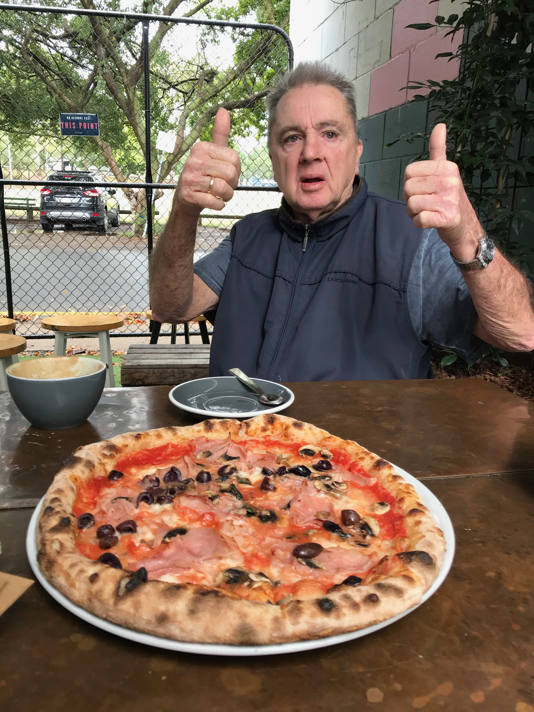
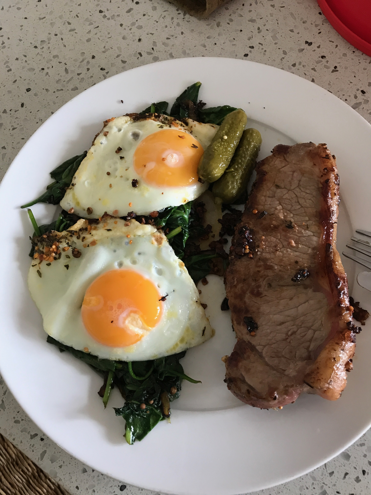

# IA, is that STEAK or PIZZA?

L'objectif de ce projet est de créer une IA qui est capable de reconnaitre si une image est une pizza ou un steak.

Pour cela, nous allons utiliser le réseau de neurones convolutif (CNN).
On cherchera donc à avoir un modèle qui a meilleur score que 50% (car 50% est le score d'une IA qui répond au hasard)
et par suite on evitera le cas d'overfitting ou d'underfitting.

La partie recherche du meilleur modèle adapté à nos besions est faite dans
le notebook: ``steak_or_pizza.ipynb``

Ensuite le fichier predict.py est le fichier qui permet de prédire si une image est une pizza ou un steak.
pour cela, il faut lancer la commande suivante:

```python predict.py image_filename```

Ici pour tester on a deux images: pizza.jpg et steak.jpg

```python predict.py pizza.jpg```


```python predict.py steak.jpg```


## Auteur
Abdoulaye Baldé