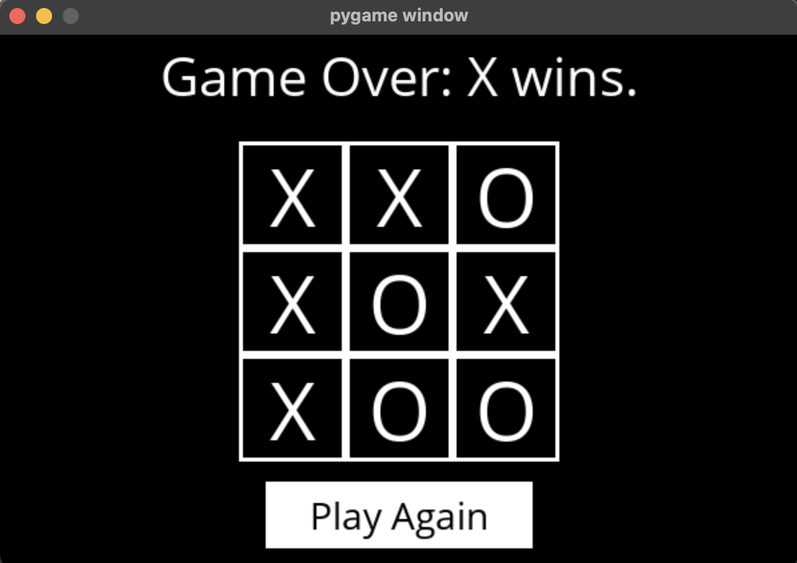

TIC-TAC-TOE : 
Création et implémentation d'une IA en language Python dans le jeu Morpion contre qui le joueur peut challenger.



Pour lancer le jeu, il faut d'abord installer les librairies nécessaires: 
```pip3 install -r requirements.txt```

Ensuite, il faut lancer le fichier runner.py: 
```python3 runner.py```